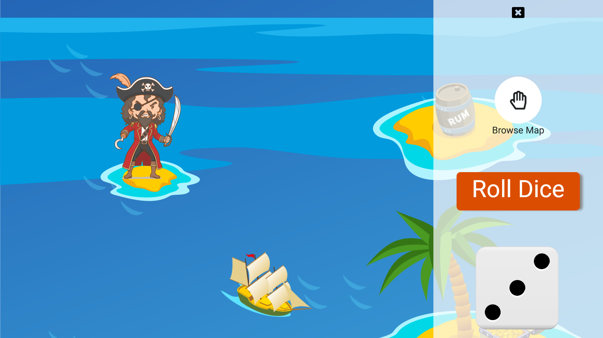

# Pirate Game - AssafMedia assignment

## Table of contents

- [Overview](#overview)
  - [The challenge](#the-challenge)
  - [Screenshot](#screenshot)
  - [Links](#links)
- [My process](#my-process)
  - [Built with](#built-with)
  - [Continued development](#continued-development)
- [Author](#author)
- [Acknowledgments](#acknowledgments)

## Overview

### The challenge

Users should be able to:

- Press on the Roll Dice button.
- See the pirate moving according to the number in the dice.
- Restart the game.
- Receive a message in the modal informing him the status of his game.

### Screenshot

### Links

I did not have the time to deploy the app yet.

## My process

### Built with

### Client side:

- Semantic HTML5 markup
- CSS custom properties
- Flexbox
- [React](https://reactjs.org/) - JS library
- [Styled Components](https://styled-components.com/) - For styles
- [React-Query](https://github.com/tannerlinsley/react-query) - To handle http request on client
- [Recoil](https://recoiljs.org/) - For state mangmanet

### Server side:

- [Node.js] - A JS runtime serverside.
- [Express] - Node.js framework
- [TypeScript-express boilerplate](https://www.npmjs.com/package/typescript-express-starter) - For faster developing
  **Note: These are just examples. Delete this note and replace the list above with your own choices**

### Continued development

There are some improvements/minor bug fixes to make in the app.

## Author

- Website - [Nitsan Cohen Portfolio](https://nitsan-portfolio.netlify.app/)
- LinkedIn - [@nitsancohen](https://www.linkedin.com/in/nitsan-cohen/)

## Acknowledgments

Thanks for my wife for taking care of the children, and for AssafMedia for the opportunity
